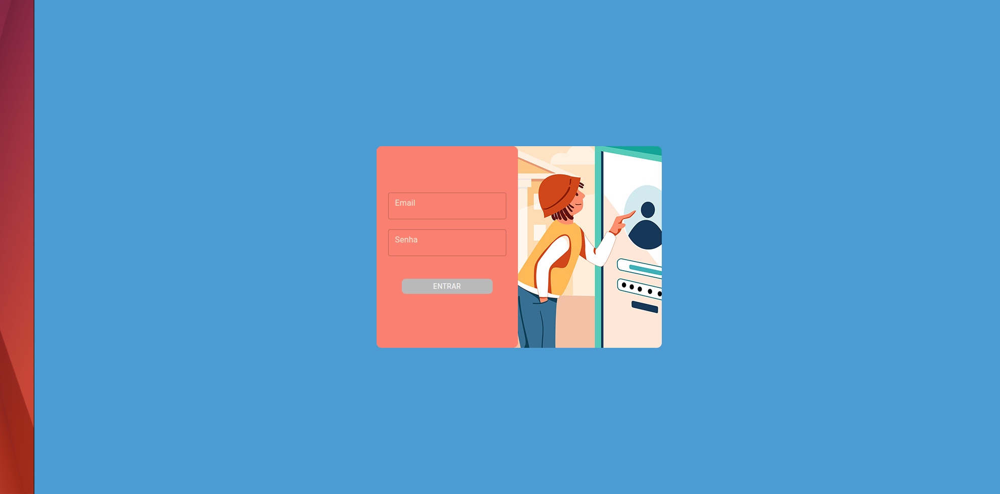
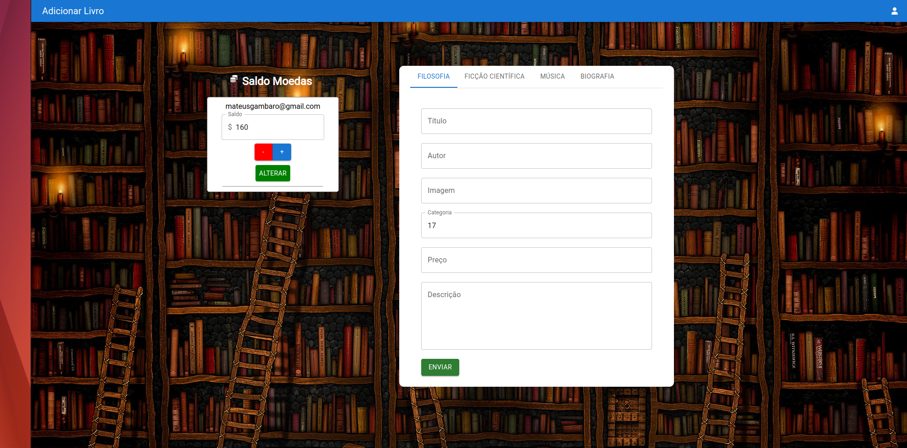
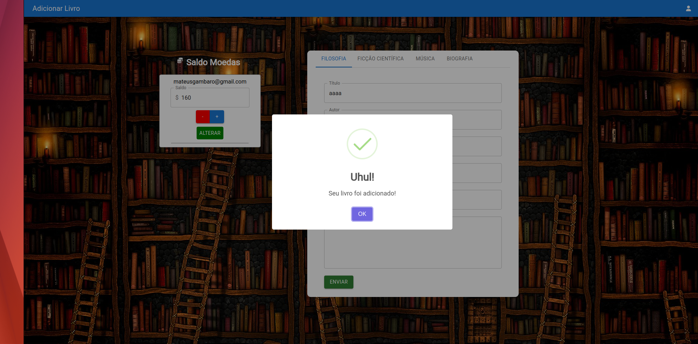
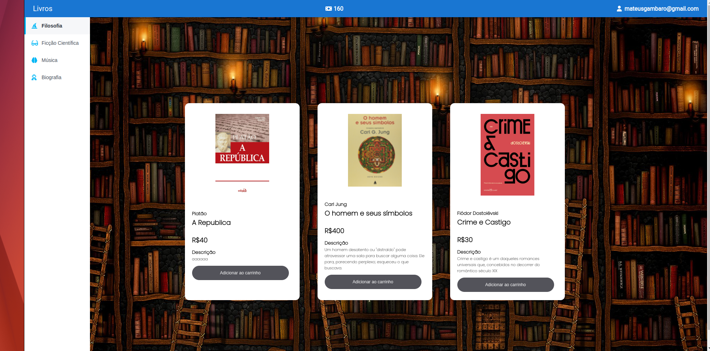

# :shopping: Online Store

## :globe_with_meridians: NETLIFY URL
https://dulcet-sopapillas-540eb7.netlify.app/

Desenvolvimento de uma aplicação de cadastro e venda de livros, e controle de moedas dos usuários da plataforma.

Os livros estão separados por categorias que mais me interessam e que fazem diferança no meu dia :)

E você, qual seu livro favorito? É só logar com a conta do administrador e cadastrar!

## :man_technologist: Admin User

Email: mateus@hotmail.com
Senha: 123456789

## :curly_haired_man: Normal User

Email: mateusgambaro@gmail.com
Senha: 13122100

## 🛠️ FrontEnd construído com

* [React Hook Form](https://react-hook-form.com/) 
* [React Router Dom](https://v5.reactrouter.com/) 
* [Material UI](https://mui.com/pt/) 
* [Axios](https://axios-http.com/docs/intro)
* [React Rainbow](https://react-rainbow.io/) 
* [FontAwesome](https://fontawesome.com/)
* [Netlify](https://www.netlify.com/)

## :closed_lock_with_key: Página de Login

## :books: Página de Cadastro de livros e controle de moedas | path "/add"

## :heavy_check_mark: Livro Cadastrado com sucesso!

## :shopping_cart: Página com lista de livros dividida por categoria (sidebar) | path "/products"

